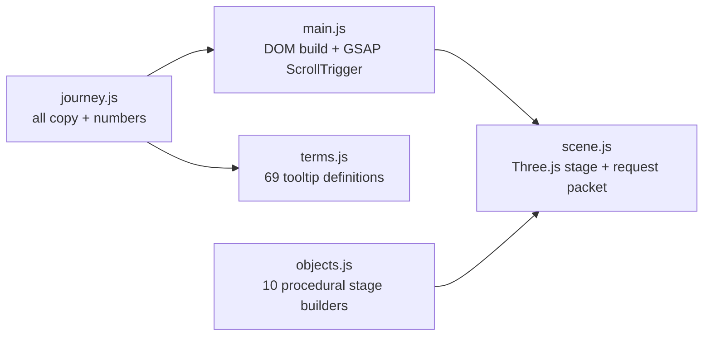

# PipelineViz

**One request, nine systems** — a scroll-driven, 3D tour of a production AI platform, in the spirit of [bbycroft.net/llm](https://bbycroft.net/llm).

Follow a single real question — an HVAC technician on a rooftop asking *"What does fault code E04 mean on the X200?"* — through the gateway, the retrieval stack, the flight recorder, the exam grader and the red team. Scroll moves a glowing request packet along the pipeline; each chapter pins an explainer panel and animates its 3D stage object.

---

## 🟢 New here? Start like this

1. Open the site and just **scroll slowly**. One chapter = one idea. Don't rush.
2. Every dotted word is a **glossary term** — hover (or tap) it for a one-sentence definition. That's the whole vocabulary of the platform, taught in place.
3. **Click any 3D stage object** for its three key facts.
4. Press **"replay the journey"** (top right) to watch the request travel the full pipeline without scrolling.
5. When done, read the repo's `GLOSSARY.md` files — they're the written version of everything the tooltips taught.

Every number shown on the site is **measured by an offline test suite** in the repo it belongs to — nothing is invented. Where a number has a caveat (like BM25 tying hybrid retrieval on a keyword-heavy corpus), the site says so.

BrandMorph is intentionally **not** on the request path: it is offline desktop tooling (PowerPoint re-branding), so it appears in the map but not in the journey.

## What's inside



- **One request's journey, 9 chapters** (plus intro + recap): identity → gateway → retrieval → forensics → evaluation → red team → platform services → recap.
- **GSAP ScrollTrigger** pins each chapter, scrubs the packet along a Catmull-Rom path, and reveals panels; **Three.js** renders the stages (all procedural geometry — no asset downloads).
- **Everything editable in one file**: `src/data/journey.js` holds every word, number and fact. `src/data/terms.js` holds every tooltip definition. Change the story without touching scene code.

## Run it

```bash
npm install
npm run dev        # http://localhost:5173
npm run build      # production bundle in dist/
npm run preview
```

Deploy: static host (Vercel/Netlify) — `vercel.json` included; framework "Vite", output `dist`.

## Accessibility & performance

- `prefers-reduced-motion`: panels render statically, the packet follows scroll without tweening, idle 3D motion is damped.
- Device pixel ratio capped at 2; procedural geometry only; keyboard-scrollable; panels are real DOM (screen-reader readable); tooltips are focus/hover driven.

## Honest limitations

- The 3D stage objects are stylized metaphors (shield, scales, magnifier), not scale models of the systems.
- The journey simplifies: in production the app may call the gateway for many requests in parallel, cache hits skip stages, and the red team runs offline.
- Built and tested on desktop Chromium; mobile layout works but is best in landscape.

## Credits & links

Part of the [AI-Systems portfolio](https://github.com/AkshayJohn03) — see `AI-Portfolio` for the map, `TUTOR_BRIEF.md` for the lecture series, and each repo's `GLOSSARY.md` for the vocabulary. Inspired by the interactive style of bbycroft.net/llm.

© 2026 Akshay John Xavier — MIT license.
